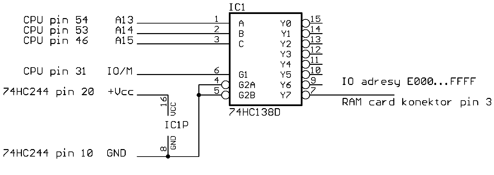

Here you can find a collection of files, scripts, and necessary files for CF card adapter equipped Atari Portfolio.
Adapter with all necessary modification description was once to be found in http://vlastikd.webz.cz/atari/cf_pofo/cfkarta.htm
It can be now accessed via [archive.org](https://web.archive.org/web/20210617000105/http://vlastikd.webz.cz/atari/cf_pofo/cfkarta.htm)
Access to CF card is provided by a small modification to the internals of PoFo, as well as a special CompactFlash card adapter, like the one below.

To access CF card use mount_drvie.sh script
Tools
- upload_a.sh / upload_b.sh - upload scripts for either removable disk A:, or built-in B:drive
- copy_folder_structure.sh - create and upload MD script for folder structure re-creation. Use it to upload a large archive folder
- mound_drive.sh - mount CF card image to a local folder
